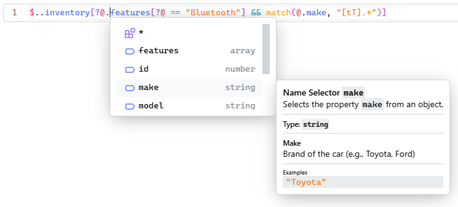

# React Editor Component

JSONPath ([RFC 9535](https://datatracker.ietf.org/doc/rfc9535/)) editor component for [React](https://react.dev/) UI framework.

## Installation

```sh
npm install @jsonpath-tools/jsonpath-editor-react
```

## Basic Usage

```tsx
import { useState } from "react";
import { JSONPathEditor } from "@jsonpath-tools/jsonpath-editor-react";
import { defaultQueryOptions, jsonSchemaToType } from "@jsonpath-tools/jsonpath";

const queryArgumentType = jsonSchemaToType({ schema: queryArgumentSchema });

export default function Example() {
    const [value, setValue] = useState(`$..inventory.*`);
    return (
        <JSONPathEditor
            value={value}
            onValueChange={setValue}
            queryOptions={defaultQueryOptions}
            queryArgument={queryArgument}
            queryArgumentType={queryArgumentType} />
    );
}
```

It should look like this:



## Theming

Style customization can be done via CSS variables. Default values of the variables are following:

```css
.editor {
    --jpe-font-text: "Segoe UI", Verdana, sans-serif;
    --jpe-font-code: "Cascadia Mono", consolas, monospace;
    --jpe-color: black;
    --jpe-background: white;
    --jpe-background-code: #e9ecef;
    --jpe-border: #ced4da;
    --jpe-primary: #7950f2;
    --jpe-dimmed: #868e96;
    --jpe-hover: #f8f9fa;
    --jpe-selection: #7950f233;
    --jpe-highlighted: #e6770033;
    --jpe-highlighted-match: #4dabf740;
    --jpe-line-current: #f1f3f5;
    --jpe-diagnostics-error: #fa5252;
    --jpe-diagnostics-warning: #fab005;

    --jpe-code-keyword: #228be6;
    --jpe-code-operator: #15aabf;
    --jpe-code-operator-control: #7950f2;
    --jpe-code-type: #40c057;
    --jpe-code-name: #4c6ef5;
    --jpe-code-identifier: #e64980;
    --jpe-code-function: #fab005;
    --jpe-code-string: #fd7e14;
    --jpe-code-number: #12b886;
    --jpe-code-brace: #fab005;
    --jpe-code-bracket: #be4bdb;
    --jpe-code-parenthesis: #be4bdb;
}
```