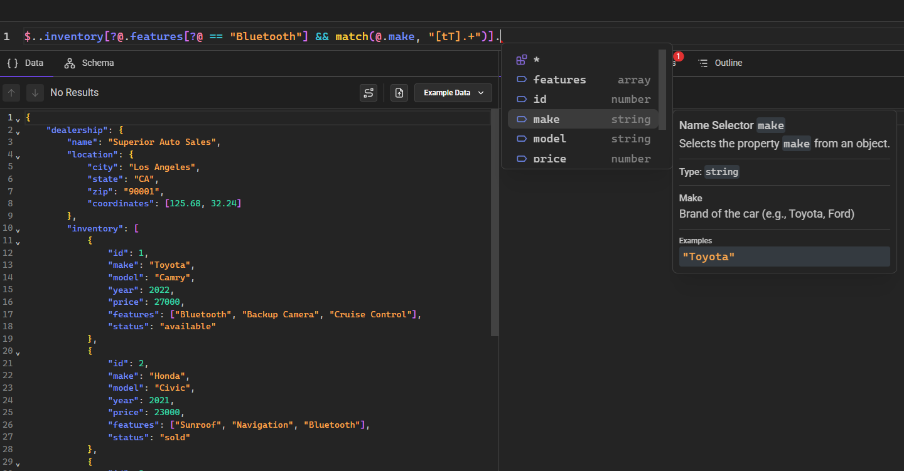

# Overview

::: warning
TODO
:::

JSONPath Tools is a set of libraries and applications for JSONPath query language ([RFC 9535](https://datatracker.ietf.org/doc/rfc9535/)). It provides tools to evaluate JSONPath queries, analyze and test them. It also contains an advanced code editor component to edit JSONPath queries.

It has the following parts:

- [Core library](/documentation/evaluator/get-started) (evaluation, analysis and editor services)
- [CodeMirror editor extension](/documentation/editor/codemirror-extension)
- [React editor component](/documentation/editor/react-component)
- [Playground web application](https://jsonpath-playground.pages.dev)

